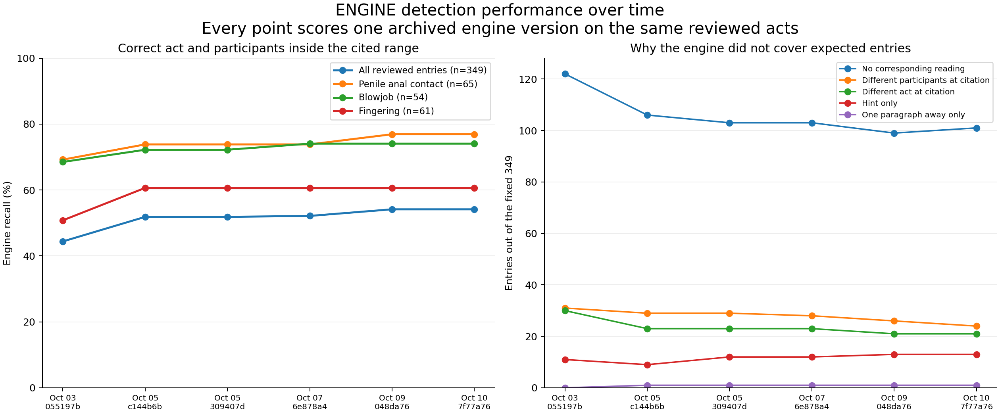
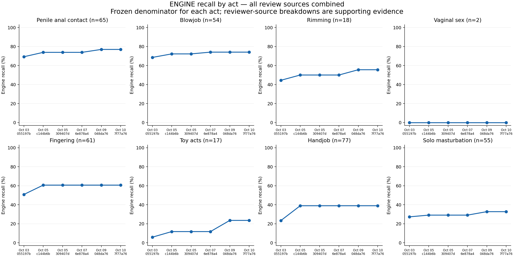
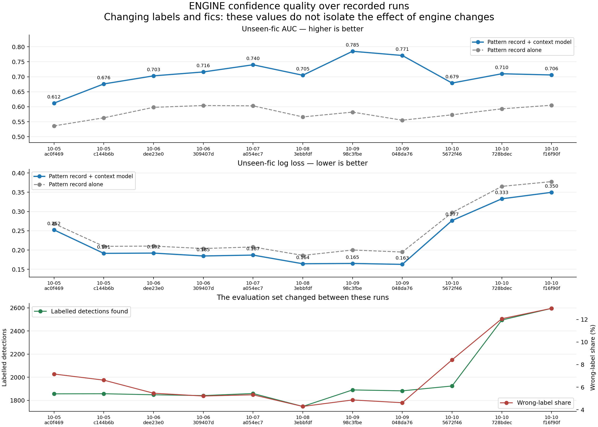
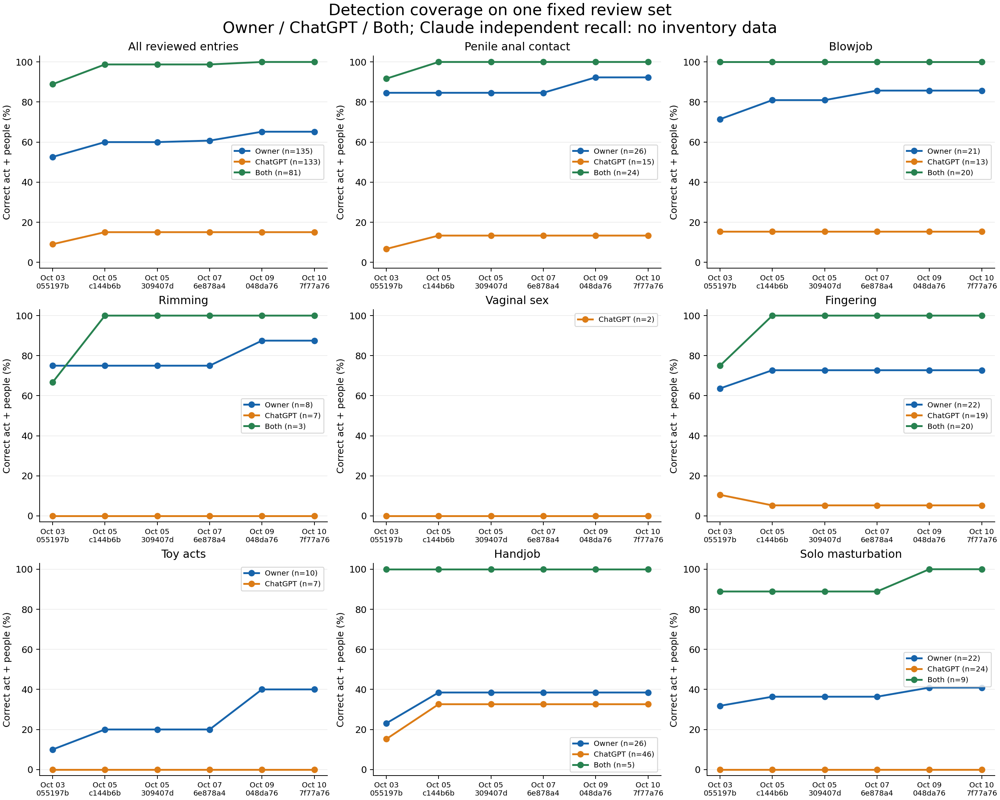
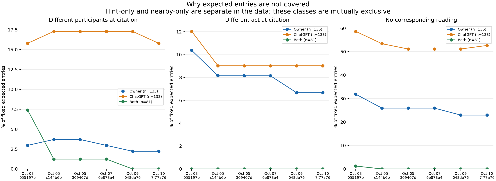
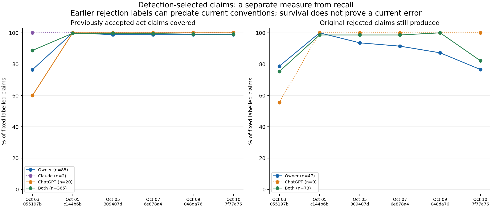

# Engine performance over time

The detection section replays six engine snapshots against the same adult fic files and reviewed evidence. The confidence section shows the saved unseen-fic AUC and log-loss evaluations. Each plotted result scores the repository engine; reviewer names identify the reference judgments.

## Engine detection — the same benchmark at every date

Each point scores the repository engine version named below it. Review sources supply the reference judgments. The main curves combine the eligible references; the source breakdown appears later.



[Detection PDF](images/engine-detection-over-time.pdf) · [Per-act PDF](images/engine-per-act-over-time.pdf)

| Engine version | Correct / expected | Recall | Uncovered expected acts | No corresponding reading | Different people at citation | Different act at citation | Hint only | Nearby only |
|---|---:|---:|---:|---:|---:|---:|---:|---:|
| 055197b | 155/349 | 44.4% | 194 | 122 | 31 | 30 | 11 | 0 |
| c144b6b | 181/349 | 51.9% | 168 | 106 | 29 | 23 | 9 | 1 |
| 309407d | 181/349 | 51.9% | 168 | 103 | 29 | 23 | 12 | 1 |
| 6e878a4 | 182/349 | 52.1% | 167 | 103 | 28 | 23 | 12 | 1 |
| 048da76 | 189/349 | 54.2% | 160 | 99 | 26 | 21 | 13 | 1 |
| 7f77a76 | 189/349 | 54.2% | 160 | 101 | 24 | 21 | 13 | 1 |

The engine correctly covered 155 → 189 of the same 349 expected entries; uncovered entries fell 194 → 160. This selected-case result supports improved act-and-participant coverage. It does not establish whole-corpus precision: the different-act/people columns are candidate mismatches, and the stored rejected claims have not all been re-adjudicated under current conventions.



## Engine confidence — recorded AUC and log loss



[Confidence PDF](images/engine-confidence-over-time.pdf) · [Confidence CSV](data/engine-confidence-over-time.csv) · [Confidence data](data/engine-confidence-over-time.json)

These are the recorded **unseen-fic** results in METRICS.md: whole fics were held out during each evaluation. The solid line is pattern record plus context; the dashed line is pattern record alone. Higher AUC means better ranking of correct versus wrong readings; lower log loss means better probabilities. AUC and log loss evaluate labelled detected readings; the inventory timeline evaluates expected acts the engine can miss.

| Recorded date | Model commit | Labelled hits | Wrong | Unseen-fic AUC | Unseen-fic log loss |
|---|---|---:|---:|---:|---:|
| 2026-10-05 | ac0f469 | 1856 | 133 | 0.612 | 0.2523 |
| 2026-10-05 | c144b6b | 1857 | 123 | 0.676 | 0.1914 |
| 2026-10-06 | dee23e0 | 1848 | 101 | 0.703 | 0.1921 |
| 2026-10-06 | 309407d | 1841 | 96 | 0.716 | 0.1846 |
| 2026-10-07 | a054ec7 | 1859 | 99 | 0.740 | 0.1869 |
| 2026-10-08 | 3ebbfdf | 1747 | 75 | 0.705 | 0.1644 |
| 2026-10-09 | 98c3fbe | 1890 | 92 | 0.785 | 0.1652 |
| 2026-10-09 | 048da76 | 1882 | 87 | 0.771 | 0.1628 |
| 2026-10-10 | 5672f46 | 1924 | 162 | 0.679 | 0.2766 |
| 2026-10-10 | 728bdec | 2495 | 301 | 0.710 | 0.3330 |
| 2026-10-10 | f16f90f | 2596 | 337 | 0.706 | 0.3498 |

The reference set changed between these runs, including the proportion and source of wrong labels and their weights. The lower panel makes that change visible. Consequently, these saved values describe each recorded evaluation; their change cannot by itself tell us whether an engine edit improved or worsened confidence on a fixed benchmark. Counts shown are unweighted; the evaluations can use label weights.

A controlled historical confidence comparison would need fixed, adjudicated claim outcomes and fic folds, compatible feature extraction for each version, and a fresh held-out replay. The archived summaries do not retain per-reviewer AUC/log loss, so no Claude/ChatGPT/Both confidence curves are inferred from them. Missing unseen-fic results are omitted rather than replaced with random-split numbers.

## Review-source detail



[Recall PDF](images/fixed-review-recall-history.pdf) · [Failure PDF](images/fixed-review-failure-history.pdf) · [Claim-survival PDF](images/fixed-review-claim-history.pdf) · [Recall CSV](data/fixed-review-recall-history.csv) · [Detailed data](data/fixed-review-history.json)

## How to read the groups

- **Owner:** your accepted judgment, taking precedence over AI judgments on that claim. In the inventory chart, this includes owner act entries and AI-inventoried acts corroborated by your accepted reading at the same citation.
- **Claude:** Claude judgment without a qualifying ChatGPT judgment of the same claim.
- **ChatGPT:** ChatGPT judgment without a qualifying Claude judgment of the same claim.
- **Both:** Claude and ChatGPT gave the same verdict on the same source-bound claim. An agreed rejection never endorses a replacement act.
- Unresolved AI disagreements are excluded from claim trends; owner-resolved cases belong to Owner.

Group percentages should be compared over time within each group, not used to rank reviewers: Both and owner-corroborated entries are enriched for previously detected acts, whereas ChatGPT-only also includes independently found misses.

Claude has no independently inventoried current-act set in the saved data, so **Claude recall is unavailable**, not zero. Claude contributes to the separate claim-survival chart, and documented Claude agreement supports the Both inventory group. The Claude-only claim sample is tiny: most of these Claude claims were also reviewed by ChatGPT. Do not treat it as representative of all Claude labels.

## Fixed inventory recall

Across the fixed 349 entries in 31 fics, coverage moved from 44.4% to 54.2%. 35 entries became correct and 1 previously correct entry became uncovered. This is a net gain in reviewed-act coverage, not proof that overall accuracy or unseen-fic performance improved.

- Coverage loss against the frozen inventory: foxden-park.html, paragraphs 1133–1144, Fingering (ChatGPT; now missed).

An entry counts only when a surviving performed reading identifies the right act and participants **inside its cited paragraph range**. Hints and readings one paragraph away do not count. Wrong people, wrong act, hint-only, nearby-only and missed are mutually exclusive explanations for an uncovered entry; they are not an exhaustive audit of every emitted detection. A different act or pair at that location may itself be valid: these columns describe candidate mismatches for the expected entry, not automatically proven false positives.

| Engine | Owner | Claude | ChatGPT | Both | Combined |
|---|---:|---:|---:|---:|---:|
| 055197b | 71/135 (52.6%) | No independent inventory | 12/133 (9.0%) | 72/81 (88.9%) | 155/349 (44.4%) |
| c144b6b | 81/135 (60.0%) | No independent inventory | 20/133 (15.0%) | 80/81 (98.8%) | 181/349 (51.9%) |
| 309407d | 81/135 (60.0%) | No independent inventory | 20/133 (15.0%) | 80/81 (98.8%) | 181/349 (51.9%) |
| 6e878a4 | 82/135 (60.7%) | No independent inventory | 20/133 (15.0%) | 80/81 (98.8%) | 182/349 (52.1%) |
| 048da76 | 88/135 (65.2%) | No independent inventory | 20/133 (15.0%) | 81/81 (100.0%) | 189/349 (54.2%) |
| 7f77a76 | 88/135 (65.2%) | No independent inventory | 20/133 (15.0%) | 81/81 (100.0%) | 189/349 (54.2%) |

### First and latest snapshot by act

| Act | Fixed entries | First correct | Latest correct | Latest wrong people | Latest wrong act | Latest hint only | Latest nearby only | Latest missed |
|---|---:|---:|---:|---:|---:|---:|---:|---:|
| Anal penetration (penis) | 65 | 45 | 50 | 3 | 2 | 6 | 0 | 4 |
| Blowjob | 54 | 37 | 40 | 1 | 2 | 0 | 1 | 10 |
| Rimming | 18 | 8 | 10 | 2 | 3 | 0 | 0 | 3 |
| Cunnilingus | 0 | 0 | 0 | 0 | 0 | 0 | 0 | 0 |
| Vaginal penetration (penis) | 2 | 0 | 0 | 0 | 0 | 0 | 0 | 2 |
| Fingering | 61 | 31 | 37 | 6 | 3 | 3 | 0 | 12 |
| Toy insertion | 17 | 1 | 4 | 1 | 2 | 2 | 0 | 8 |
| Handjob | 77 | 18 | 30 | 8 | 9 | 2 | 0 | 28 |
| Solo masturbation | 55 | 15 | 18 | 3 | 0 | 0 | 0 | 34 |

The historical names “penetration” and “insertion” include qualifying entrance contact under current AGENTS.md. Fingering combines anal and vaginal fingering. Hands-free orgasm is not one of these nine act categories. Cunnilingus has no eligible inventory entries; no recall estimate is available.



## Previously labelled claim survival

The fixed claim set contains 601 supported, source-verified performed-act claims. Hints, contextual and unsupported categories are outside this comparison.

This is separate from independent recall. Accepted-act coverage allows the matching pattern to change. Rejected-original survival requires the same cited paragraph, normalized pattern, act and participants. This comparison matches paragraph, normalized pattern, act and participants; it does not match a full sentence hash. A rejected original disappearing does not prove the underlying error was fixed: another pattern can still make a wrong reading. Older rejection labels may conflict with the current entrance-contact convention; these are historical judgments, not newly adjudicated errors. Some rejections can concern confidence or event framing; survival alone does not establish a present-day false positive.



| Source | Fixed accepted claims | First covered | Latest covered | Fixed rejected claims | First surviving | Latest surviving |
|---|---:|---:|---:|---:|---:|---:|
| Owner | 85 | 65 | 84 | 47 | 37 | 36 |
| Claude | 2 | 2 | 2 | 0 | 0 | 0 |
| ChatGPT | 20 | 12 | 20 | 9 | 5 | 9 |
| Both | 365 | 324 | 362 | 73 | 55 | 60 |

## Verification and limits

- Frozen evidence fingerprint: `5c20e965c78ee23d2fcce607d771e62071efb3bd74795555babd329724af03a7`. Scoring fingerprint: `1306b6cd9373bcb3959a63bffe822840ce9e28dd55cb5f8c3adb4ba9d7d9df97`.
- 40 adult source files were replayed; only source-verified cited entries contribute to scores.
- 0 additional inventory entries and 137 claims were excluded globally for unavailable or unverifiable citations; denominators stay constant across all dates. The initial baseline excluded 27 source-unverified entries and 3 adjudication-needed entries; this historical comparison additionally leaves out its 11 partial owner/assistant entries. Unsupported and historical inventory events remain outside scope.
- 21 unresolved AI disagreements were excluded from claim trends.
- Source file SHA-256 and paragraph extraction checksums are checked. Every scored fic must have identical paragraph extraction across all snapshots. Missing provenance is excluded, never guessed.
- Original Claude judgments and ChatGPT judgments of those original claims come from the archived Oct 4/5 review page. Claude’s second review of ChatGPT labels uses the completed `cffe355` snapshot; later owner-restored weights are not mistaken for Claude agreement.
- All snapshots use the current frozen HTML extractor and installed dependency lockfile. This isolates detector changes, rather than recreating each historical browser build or parser. All snapshots use normal tagged analysis with the same metadata; this is not a tag-free comparison.
- Dates on detection charts are commit dates in America/New_York; confidence dates follow the recorded METRICS.md rows; hashes distinguish snapshots on the same day. The first commit is Oct 3 locally / Oct 4 UTC.
- Expected entries are exact deduplicated review records, not necessarily unique scenes. Overlapping ranges can describe the same scene. Reviews over-sample suspected errors, so percentages are not whole-corpus prevalence estimates.
- Recall is measured on internal surviving audit readings, not guaranteed displayed scene cards. The fixed inventory counts measure act detection. The separate confidence section uses recorded unseen-fic AUC/log loss evaluations.
- No new false positives outside the frozen expected-act and labelled-claim sets are scored. Broader precision needs an independent review sample of all emitted readings.

## Reproduce

Use the vetted adult corpus and keep the output directory private:

```sh
node scripts/freeze-recall-evidence.mjs /tmp/recall-history/frozen-evidence.json
node scripts/replay-recall-history.mjs /path/to/adult-fics /tmp/recall-history
node scripts/build-recall-history.mjs /tmp/recall-history
python scripts/plot-recall-history.py /tmp/recall-history/FIXED_REVIEW_HISTORY.json /tmp/recall-history/charts
python scripts/plot-confidence-history.py docs/METRICS.md /tmp/recall-history/charts
```

The commands create the private output directory. The replay script archives detector source without changing branches, runs up to three workers, and reuses checksum-matched snapshots. It never prints or saves fic prose. The chart script needs matplotlib. The published JSON contains hashes, reviewer provenance and reading metadata only. Per-run eventIndex and claimIndex point into its frozen events and claimEvidence arrays; the full private output additionally keeps matching-hit metadata.
